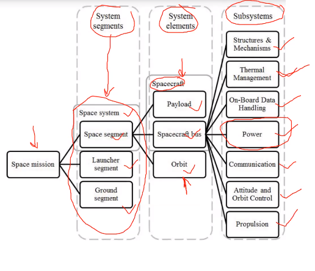
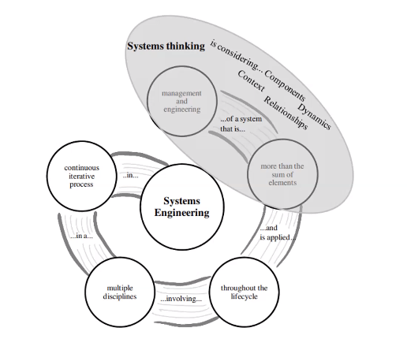
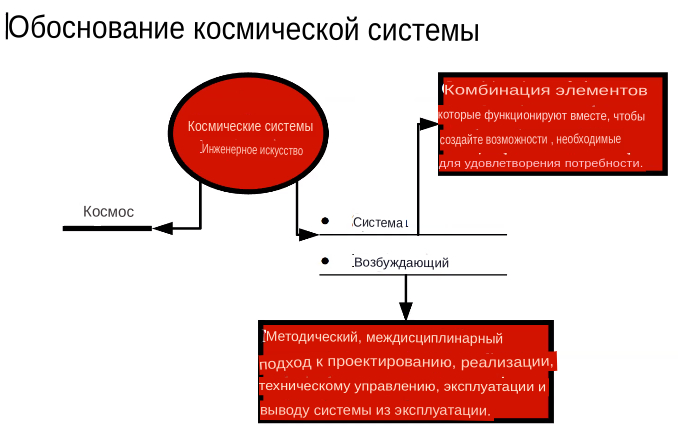
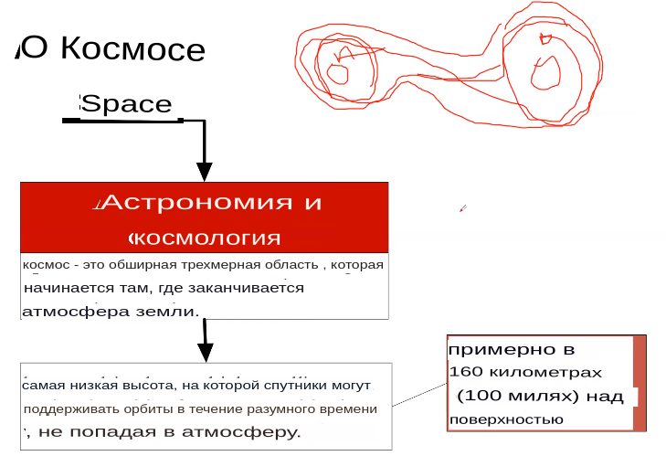
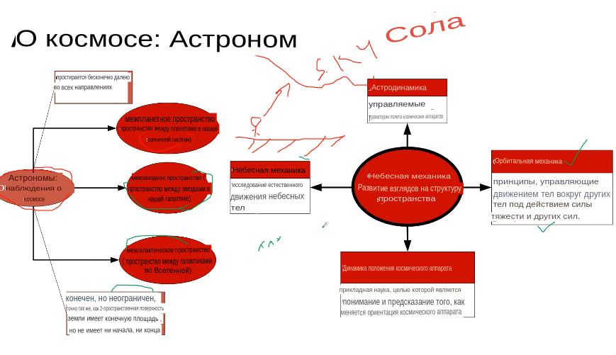
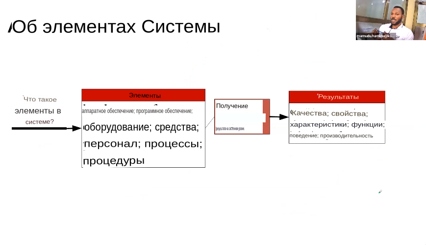

# Введение

Дорогие коллеги!

Мы рады приветствовать всех от имени Worldskills Russia,нашего международного эксперта г-на Александра Макарова, Space Systems Команда инженерных экспертов и Политехнический колледж имени Годовикова. Мы рады сообщить об идее наших дорогих экспертов начать Дополнительная профессиональная программа для переквалификации "Основы космических операций при разработке системы дистанционного зондирования Земли Спутниковый проект" на основе стандартов WorldSkills для космического Системная инженерия. Мы хотели бы пригласить Вас к сотрудничеству в процессе составления программы. По мнению нашей команды экспертов, программа должна быть направлена на развитие навыков, необходимых для выполнения нового вида профессиональной деятельности и получения новой квалификации, развитие международного сотрудничества и обмен идеями и знаниями. Мы знаем, что среди учителей по всему миру есть много подходящих специалистов в этой области. Мы с нетерпением ожидаем набора учителей для участия в этой программе, чтобы стать частью движения WS и повысить уровень космического образования.

## Модули


| № | Наименование                                         | Кол-во часов |
|---|------------------------------------------------------|--------------|
| 1 | ИКС как явление и динамика её систем                 | 3            |
| 2 | Состав и функции космических аппаратов               | 5            |
| 3 | Проектирование и моделирование космических аппаратов | 9.5          |
| 4 | Электронные схемы                                    | 3            |
| 5 | Программирование                                     | 9.5          |
| 6 | Изготовление и сборка космических аппаратов          | 6            |
|   | Всего часов                                          | 36           |
|   | Подведение итогов                                    | 4            |

# ИКС как явление и данамика её систем

## Природа ИКС с точки зрения инженерии систем

### Состав космического аппарата

```mindmap
- Космическая миссия
    - Системные сегменты
        - Космический аппарат [космическая система]
            - Системные элементы
                - Полезная нагрузка
                - Элементы [spacecraft bus]
                    - Подсистемы
                        - Структуры и механизмы
                        - Управление температурой (контроль нагрева)
                        - Управление бортовыми данными (сбор данных и связь между системами)
                        - Система питания
                        - Система связи
                        - Контроль высоты и орбиты
                        - Движение

            - Орбита

        - Пусковые сегменты
        - Основополагающие (наземные) сегменты
```



*Космические аппараты* ---
: объекты, которые находятся в космосе.

### Инженерия систем
Основной вопрос при проектировании космической системы -- какую системы вы хотите создать, какова ее цель, какого ее функционирование, назначение. При этом учитывается жизненный цикл системы.

Жизненный цикл является важным аспектом разрабатываемой системы. Он включает в себя технические аспекты и аспекты управления, возникающие при разработке космической системы. Это означает, что жизненный цикл включает в себя множество дисциплин.

Также разработка космического аппарата включает создание модели или макета. Это необходимо, ведь система будет требовать постоянной доработки, как на стадии проектирования и макетирования, так и в процессе использования. Доработка аппарата -- это длительный и комплексный процесс.



Инженерия космических систем включает в себя такие важные аспекты, как системы и проектирование. Система подразумевает объединение различных компонентов.



Проектирование включает в себя методичный процесс создания всех деталей, что значит, что нам необходимо проектировать, моделировать, изучать основные требования, и иногда тестировать созданные системы. Это ключевые аспекты проектирования систем.


### Немного о небесной механике
МКА будут работать в космическом, обширном трехмерном пространстве, имеющем долготу, широту, высоту (x, y, z). Данное пространство можно изучать как находясь в нем, с помощью МКА, так и со стороны, при помощи астрономии. Assтроном находится на земле, но наблюдает за небом, за космосом. В космических (астрономических) системах мы выделяем следующие системы: солнечная система, межпланетное пространство, межзвездное и межгалактическое пространство. Говоря о безграничности пространства, надо учитывать поведение Земли и космических аппаратов вокруг нее. Тут нам поможет орбитальная (небесная[^nm]) механика.

[^nm]: Небесная механика — раздел астрономии, применяющий законы механики для изучения и вычисления движения небесных тел, в первую очередь Солнечной системы (Луны, планет и их спутников, комет, малых тел), и вызванных этим явлений (затмений и проч.).



*Орбитальная (небесная) механика* --- 
: принцип, позволяющий объектам приходить в движение вокруг других тел. *Это наука о естественном движении небесных тел.*

Есть ряд сил, приводящий все объекты в движение. Солнечная система включает все множества таких сил. Важно, чтобы космические аппараты имели возможность перемещаться в пространстве, используя эти силы. Здесь стоит отметить *астродинамику[^assd]*.

[^assd]: Астродинамика (от др.-греч. ἄστρον — «звезда» и δύναμις — сила) — раздел небесной механики, изучающий движение искусственных космических тел: искусственных спутников, межпланетных станций и других космических кораблей. <br/> В сферу задач астродинамики входят расчёт орбит космических кораблей, определение параметров их запуска, вычисление изменений орбит в результате манёвров, планирование гравитационных манёвров и другие практические задачи. Результаты астродинамики используются при планировании и проведении любых космических миссий. <br/> Астродинамика выделяется из небесной механики, которая изучает в первую очередь движение естественных космических тел под действием сил тяготения, своей ориентированностью на решение прикладных задач управления космическими кораблями. В связи с этим в астродинамике требуется учитывать и факторы, игнорируемые классической небесной механикой — влияние атмосферы и магнитного поля Земли, гравитационных аномалий, давления солнечного излучения и другие



## Элементы системы
Системы состоят из различных элементов: 
* Аппаратного обеспечения
* Программное обеспечение
* Оборудование
* Устройства
* Персонал
* Процессы
* Процедуры

Результатами действия систем является существование различных характеристик, свойств, форм поведения, производительности. 



## Основные законы и формулы, движение искусственных спутников
